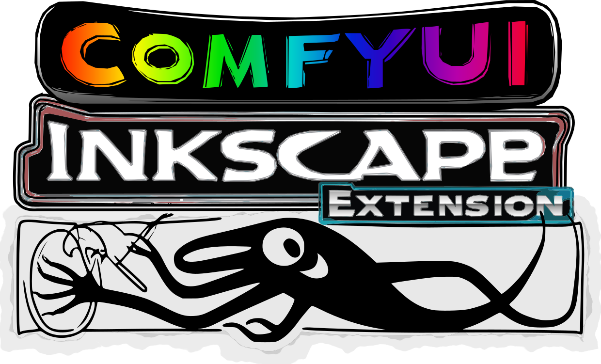
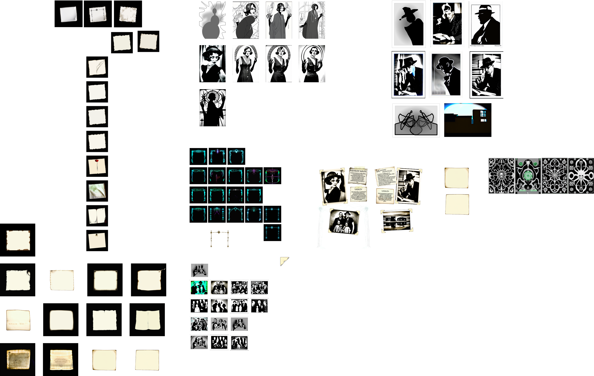
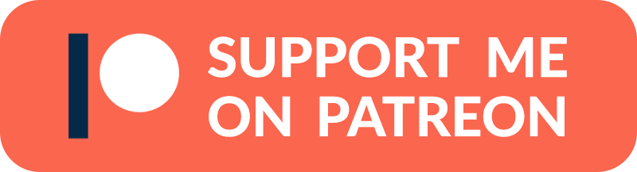
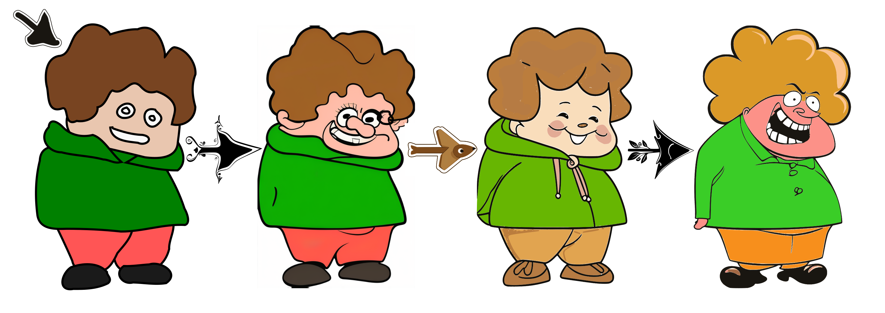
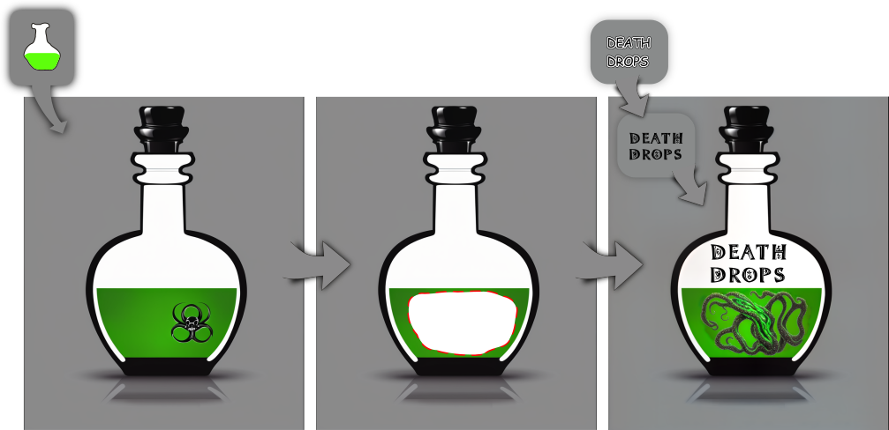

# Inkscape ComfyUI Extension
An Inkscape extension that integrates ComfyUI - turning Inkscape into Recraft++

The **Inkscape ComfyUI Extension** integrates Inkscape with the ComfyUI API, enabling users to generate images based on selected SVG objects and specified prompts. This extension facilitates the creation of AI-generated images directly within Inkscape, streamlining the design workflow.

## Key Features:
 * AI Image Generation: Transform selected SVG elements into AI-generated images using custom positive and negative prompts.
 * Seamless Integration: Directly interact with the ComfyUI API from within Inkscape.
 * Customizable Parameters: Adjust settings such as CFG Scale, Denoise, Seed, and Steps to fine-tune image generation.
 * Workflow Management: Load and utilize predefined workflows in JSON format.
 * Text to Image
 * Inpainting

## New Features
 * Batch option: Once you have a look you like, generate a batch.
 * Workflows are now embedded in code as a fallback when no workflows are selected.

## Dependencies:
 * Inkscape: Version 1.3.2 or higher.
 * ComfyUI API: Accessible at the specified API URL (default: 127.0.0.1:8188).

## Compatibility:
 * Operating Systems: Compatible with Windows, macOS, and Linux.
 * Inkscape Versions: Designed for Inkscape 1.0 and above.

## Installation:
1. [Set Up ComfyUI](https://stable-diffusion-art.com/how-to-install-comfyui/): Ensure ComfyUI is running and accessible at the specified API URL.
2. [Install Inkscape](https://inkscape.org/release/inkscape-1.4/)
3. Install Extension: Place the extension files in Inkscape’s user extensions directory. 
   You can find this folder in:
      - Edit>Preferences or Inkscape>Settings on Mac
      - Select System
      - Press the **"Open"** button next to "User extensions"

4. The files that you need to copy are: 
    > comfyui_extension.py 
    > comfyui.inx
5. Restart Inkscape: Restart Inkscape to load the new extension.

## Setup:
1. Api version workflows are included and embedded in code if none are selected as a fallback - check to ensure you have all the right models by opening each in ComfyUI first.
   * Or use your own after saving it to API format.
2. The features are currently limited to:
     * A positive prompt
     * A negative prompt
     * An image input
     * A KSampler's:
       * CFG Scale
       * Denoise
       * Seed (-1 for random seed)
       * Steps
     * A mask input for inpainting (mask element id must include '__mask')
     * A pose input for pose estimation (pose element id must include '__pose')
3. If you're using the default workflows provided the following section regarding the IDS should already be correctly set up, and can be ignored for now.
4. You need to find the correct IDs in the JSON file and set those in the IDs tab.
   * These IDs will differ from what you see in your normal (non-API) workflow in ComfyUI, so remember to check.
   * Defaults for these IDs have been set up to match those in the following folder: 
     > assets/workflows/api
5. If your ComfyUI IP or port differs, update to match.
   * If ComfyUI is on a different PC on your network, remember to start it with the argument: 
   > "--listen 0.0.0.0"
6. Remember to follow the above process when you change the workflow. 

## Usage:
### Text To Image
1. Extensions>Render>ComfyUI
2. If you haven't done the setup, do so now
3. Make sure the "Text To Image" workflow is selected
4. Enter your prompt and select your values
5. Press Apply
6. Wait for ComfyUI to finish producing your results
7. Groovy.

### Image To Image
1. Draw something and make sure it's selected or select an existing object. (grouping helps)
2. Extensions>Render>ComfyUI
3. If you haven't done the setup, do so now
4. Make sure the "Image To Image" workflow is selected
5. Enter your prompt and select your values
6. Press Apply
7. Wait for ComfyUI to finish producing your results
8. Rave in awe!

### Inpainting
1. Mask Group
   1. Start by drawing a rectangle matching the bounding box of the full input, and make it transparent.
   2. Group it.
   3. Right-click on the group and select "Object Properties"
   4. Make sure that the ID includes the string "__mask" and press the Set button
   5. Now you can create shapes to mask out areas inside this group.
2. Select your input as well as the mask group
3. Extensions>Render>ComfyUI
4. If you haven't done the setup, do so now
5. Make sure the "Inpainting" workflow is selected
6. Enter your prompt and select your values
7. Press Apply
8. Wait for ComfyUI to finish producing your results
9. Death Drop!

### Additionally
* Once you have the image, it is a simple matter of tracing the bitmap. You can find this feature at **Path>Trace Bitmap**. Play around with the settings.
* It often helps to combine the results with the same prompt to refine the outcome - play around!

### Tips
* Set seed to -1 for random seed
* To see all the values used to generate an image, select that image, then in the file menu 
    > Edit > XML Editor
  * Click on the __inkscape:custom_metadata__ attribute to see the prompts and other values selected to generate the image.
  * Handy for reuse of previous seeds and prompts.

## Security Considerations:
 * API Interactions: The extension communicates with the ComfyUI API via HTTP requests. Ensure the API URL is correctly configured and secure.
 * File Handling: Temporary files are created during image processing. The extension manages these files securely, but users should be aware of their system’s temporary directory policies.

By integrating AI-driven image generation into Inkscape, this extension enhances creative workflows, offering designers a powerful tool to expand their design capabilities.

## Help Wanted
I'm very open to help from others!
### Ways you could help:
* Unit tests: I've set up some very bare-bone scaffolding, but to make this
extension available in the Inkscape extension manager, it first needs to pass the
[review process](https://inkscape.gitlab.io/extensions/documentation/authors/submit.html), which requires tests.
* Custom workflows and/or workflow history: Adding stuff to Inkscape extensions is a bit clumsy the way I'm doing it. I'm sure there are 
more elegant ways that would allow lists and dynamically populated dropdowns using Gtk, for instance.

It would be great to improve the UI if anyone has the know-how to assist!
* "Relative masking": If a mask element is on top of the input element it should automatically clip the mask according 
to the transform and position of the input element.
* Suggesting features I haven't thought of.
* Suggesting improvements. 

## Credits:

* Basic SDXL Txt2Img Workflow by OpenArt:
https://openart.ai/workflows/openart/basic-sdxl-workflow/P8VEtDSQGYf4pOugtnvO
* Basic SDXL Img2Img Workflow by OpenArt:
https://openart.ai/workflows/openart/basic-sdxl-img2img-workflow/yrUf3Yj2kqSHVbZsS9vy
* Basic Inpainting modded from Prompting Pixels:
https://promptingpixels.com/comfyui-workflows/

# COMING SOON
* Pose Estimation

