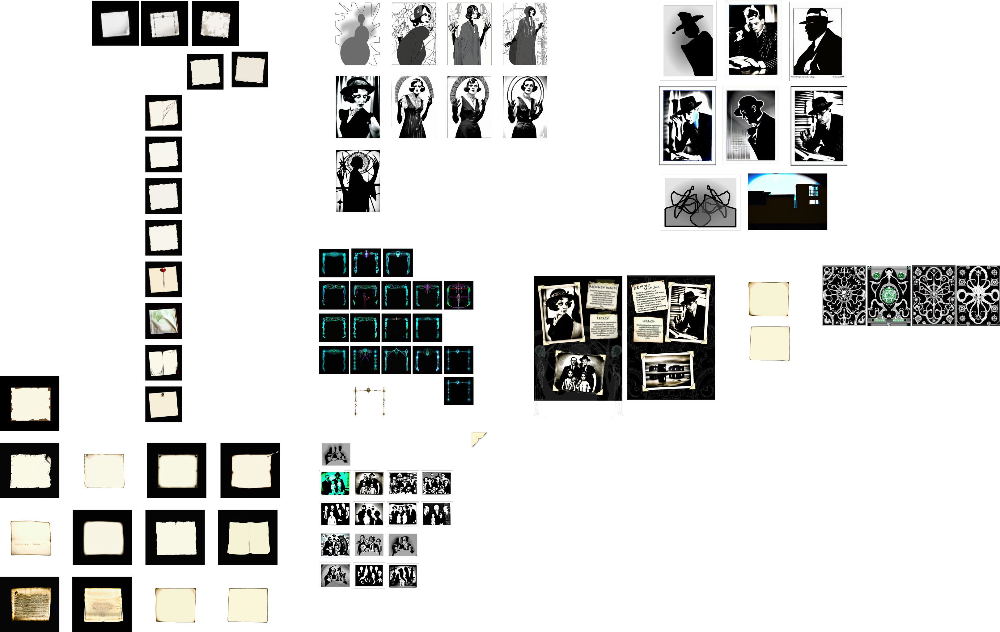

# Inkscape ComfyUI Extension
An Inkscape extension that integrates ComfyUI - turning Inkscape into Recraft++

The **Inkscape ComfyUI Extension** integrates Inkscape with the ComfyUI API, enabling users to generate images based on selected SVG objects and specified prompts. This extension facilitates the creation of AI-generated images directly within Inkscape, streamlining the design workflow.

## Key Features:
 * AI Image Generation: Transform selected SVG elements into AI-generated images using custom positive and negative prompts.
 * Seamless Integration: Directly interact with the ComfyUI API from within Inkscape.
 * Customizable Parameters: Adjust settings such as CFG Scale, Denoise, Seed, and Steps to fine-tune image generation.
 * Workflow Management: Load and utilize predefined workflows in JSON format.

## New Features
 * Text to Image
 * Inpainting

## Dependencies:
 * Inkscape: Version 1.3.2 or higher.
 * ComfyUI API: Accessible at the specified API URL (default: 127.0.0.1:8188).

## Compatibility:
 * Operating Systems: Compatible with Windows, macOS, and Linux.
 * Inkscape Versions: Designed for Inkscape 1.0 and above.

## Installation:
1. Set Up ComfyUI: Ensure ComfyUI is running and accessible at the specified API URL.
2. Install Inkscape
3. Install Extension: Place the extension files in Inkscape’s user extensions directory. You can find this folder in:

      - Edit>Preferences or Inkscape>Settings on Mac
      - Select System
      - Press the **"Open"** button next to "User extensions"
4. Restart Inkscape: Restart Inkscape to load the new extension.

## Setup:
1. Api version workflows are included - check to make sure you have all the right models by opening each in ComfyUI first.
   * Or use your own after saving it to API format.
2. The features are currently limited to:
     * A positive prompt
     * A negative prompt
     * An image input
     * A KSampler's:
       * CFG Scale
       * Denoise
       * Seed
       * Steps
     * A mask input for inpainting (mask element id must include '__mask')
     * A pose input for pose estimation (pose element id must include '__pose')
3. You need to find the correct IDs in the JSON file and set those in the IDs tab.
   * These IDs will differ from what you see in your normal (non-api) workflow in ComfyUI, so remember to check.
   * Defaults for these ID's have been set up to match those in the following folder: 
     > assets/workflows/api
4. If your ComfyUI IP or port differs, update to match.
   * If ComfyUI is on a different PC on your network, remember to start it with the argument: 
   > "--listen 0.0.0.0"
5. Remember to follow the above process when you change the workflow. Would be nice to improve this to a history of workflows that can be selected from - help welcome!

## Usage:
### Text To Image
1. Extensions>Render>ComfyUI
2. If you haven't done the setup, do so now
3. Make sure "Text To Image" workflow is selected
4. Enter your prompt and select your values
5. Press Apply
6. Wait for ComfyUI to finish producing your results
7. Groovy.

### Image To Image
1. Draw something and make sure it's selected or select an existing object. (grouping helps)
2. Extensions>Render>ComfyUI
3. If you haven't done the setup, do so now
4. Make sure "Image To Image" workflow is selected
5. Enter your prompt and select your values
6. Press Apply
7. Wait for ComfyUI to finish producing your results
8. Rave in awe!

### Inpainting
1. Mask Group
   1. Start by drawing a rectangle matching the bounding box of the full input, and make it transparent.
   2. Group it.
   3. Right-click on the group and select "Object Properties"
   4. Make sure that the ID includes the string "__mask" and press the Set button
   5. Now you can create shapes to mask out areas inside this group.
2. Select your input as well as the mask group
3. Extensions>Render>ComfyUI
4. If you haven't done the setup, do so now
5. Make sure "Inpainting" workflow is selected
6. Enter your prompt and select your values
7. Press Apply
8. Wait for ComfyUI to finish producing your results
9. Death Drop!

### Additionally
* Once you have the image, it is a simple matter of tracing the bitmap. You can find this feature at **Path>Trace Bitmap**. Play around with the settings.
* It often helps to combine the results with the same prompt to refine the outcome - play around!

## Security Considerations:
 * API Interactions: The extension communicates with the ComfyUI API via HTTP requests. Ensure the API URL is correctly configured and secure.
 * File Handling: Temporary files are created during image processing. The extension manages these files securely, but users should be aware of their system’s temporary directory policies.

By integrating AI-driven image generation into Inkscape, this extension enhances creative workflows, offering designers a powerful tool to expand their design capabilities.

### Credits:

* Basic SDXL Txt2Img Workflow by OpenArt:
https://openart.ai/workflows/openart/basic-sdxl-workflow/P8VEtDSQGYf4pOugtnvO
* Basic SDXL Img2Img Workflow by OpenArt:
https://openart.ai/workflows/openart/basic-sdxl-img2img-workflow/yrUf3Yj2kqSHVbZsS9vy
* Basic Inpainting modded from Prompting Pixels:
https://promptingpixels.com/comfyui-workflows/

# COMING SOON
* Pose Estimation

